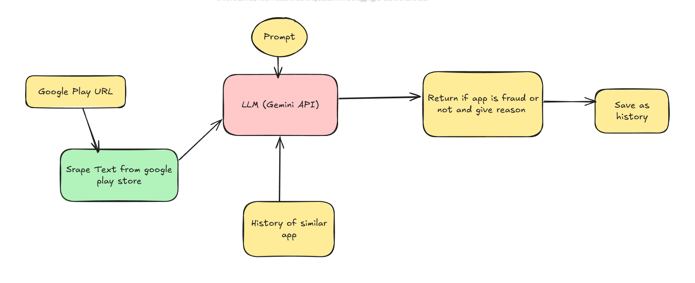

# Fautecl 

The **Fautecl** is designed to analyze applications on the Google Play Store and determine whether they exhibit fraudulent behavior. The system utilizes a combination of web scraping, historical data analysis, and a **Large Language Model (LLM)** (Gemini API) to classify apps as **fraudulent, suspected, or genuine** based on specific criteria.



## Workflow
The detection process follows these key steps:

### 1. **Input: Google Play URL**
- The system takes a Google Play Store URL as input.
- This URL is used to retrieve app-related information.

### 2. **Scraping App Data**
- The system extracts textual information from the Play Store page, including:
  - App name, developer, and category
  - App description and metadata
  - User reviews and ratings
  - Permissions requested by the app
  
### 3. **LLM Analysis (Gemini API)**
- The extracted data is passed to the **Gemini API**, which is prompted with predefined fraud detection rules.
- The model considers:
  - Excessive permissions that do not align with the app’s purpose
  - A high number of fake/spam reviews
  - Misleading app descriptions
  - Manipulative tactics (e.g., fake installs, aggressive ads, keyword stuffing)

### 4. **Using Historical Data**
- The system also compares the app with similar known apps in its database.
- If historical records indicate similar fraud patterns, the app may be flagged accordingly.

### 5. **Classification & Reasoning**
- The LLM classifies the app into one of the following:
  - **Fraud**: Strong evidence of fraud is detected.
  - **Suspected**: Some warning signs exist, but not enough for a fraud classification.
  - **Genuine**: No strong fraud signals are present.
- A concise **reason** is provided for each classification.

### 6. **Saving Results for Future Analysis**
- The system saves the app’s classification and reasoning as historical data for future reference.

The final output follows this JSON structure:
```json
{
    "type": "fraud" | "genuine" | "suspected",
    "reason": "Concise explanation (max 300 chars)"
}
```


### To run locally
- Clone the repo
- Run the command
```
pip install -r requirements.txt
```

- Make .env file and put GEMINI_API_KEY = ""
- To run app
```
streamlit run app.py
```


## Fraud Detection Rules
The system uses a **balanced yet rigorous** approach to avoid false positives and ensure fairness. Apps are classified based on the following:

### **Fraud Indicators**
- 🚨 Excessive permissions that do not match app functionality.
- 🚨 A large number of suspicious, repetitive, or fake reviews.
- 🚨 Misleading app descriptions or impersonation.
- 🚨 Aggressive monetization (e.g., forcing payments before providing functionality).
- 🚨 Keyword stuffing or fake installs to manipulate rankings.

### **Suspected Indicators**
- ⚠️ Some misleading elements in branding or descriptions.
- ⚠️ A mix of fake and real reviews with suspicious patterns.
- ⚠️ Multiple user complaints about deceptive behavior.
- ⚠️ Unusual monetization tactics or inconsistent app behavior.


## Future Improvements
- ✅ Implement **FAISS** vector storage for efficient fraud pattern matching.
- ✅ Improve **LLM prompt engineering** to better detect nuanced fraud behavior.
- ✅ Enhance **historical data comparison** using app embeddings.

## Conclusion
The **Fraud App Detection System** provides an automated way to analyze apps, leveraging LLMs and historical data to ensure fair yet effective fraud detection. By continuously refining detection rules and incorporating feedback, the system aims to enhance fraud prevention in the digital marketplace.